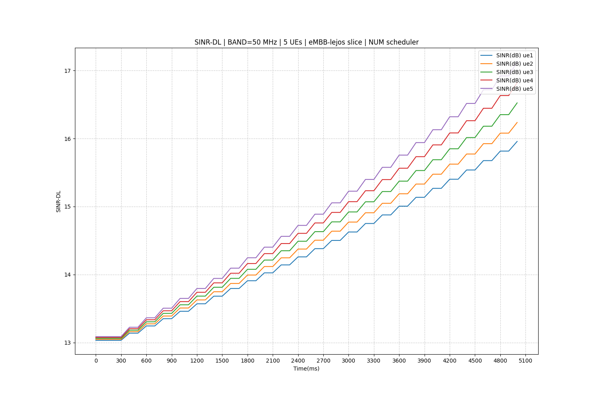
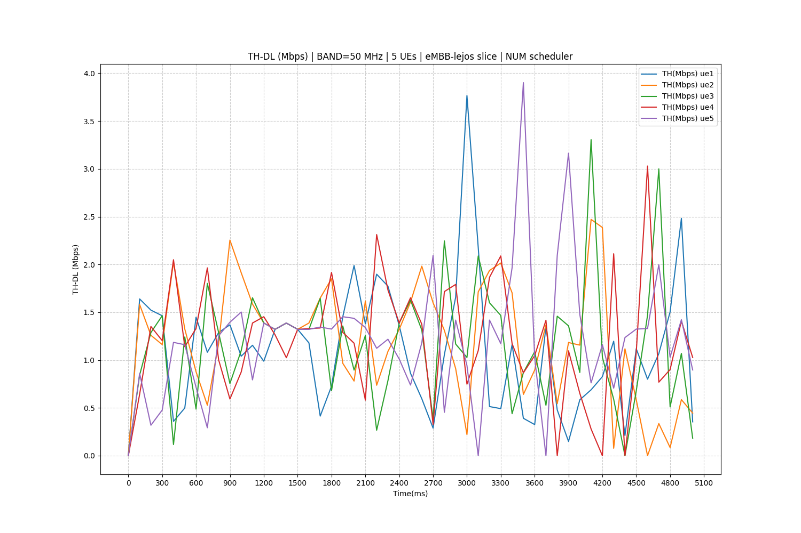

# Py5cheSim v2.0

Py5cheSim es un simulador para redes 5G desarrollado en *Python*, flexible y de código abierto. El mismo está basado en *SimPy*, el cual es un *framework* para la simulación de eventos discretos y es utilizado para simular el envío y recepción de paquetes. Su objetivo es generar métricas de rendimiento a nivel de celda sobre *schedulers* implementados por el usuario en una configuración establecida, evitando así la necesidad de llevarlo a un ambiente real. El mismo está enfocado en la asignación de recursos entre diferentes usuarios y servicios con diferentes requerimientos.

## ¿Qué hay de nuevo en la versión 2?

En esta nueva versión se integró el *framework* DeepMIMO para obtener canales más realistas entre usuarios con movimiento y radio bases. Obteniendo de esta manera un canal selectivo en frecuencia y que varía en el tiempo según un movimiento definido.

También se mejoró el soporte para SU-MIMO y MU-MIMO teniendo en cuenta el estado de canal para la asignación de *layers*. 

Estas nuevas características abrieron las puertas para que se puedan evaluar la performance de *schedulers* que tengan en cuenta el estado detallado del canal. Por esta razón se implementó un *intra slice scheduler* que utiliza estos nuevos datos y sirve como ejemplo para implementaciones posteriores.

Por último y alineado con el punto anterior, ahora el simulador también devuelve como salida una grilla de uso de los recursos físicos entre los diferentes usuarios.

## Instalación sugerida

Para utilizar este simulador es necesario contar con un intérprete de Python 3 instalado y realizar las siguientes acciones:

  - Abrir una consola y cambiar el directorio de trabaja a la raíz del proyecto.
  - Crear un ambiente virtual: `python3 -m venv env`
  - Instalar las dependencias del proyecto: `pip install -r requirements.txt`

## Procedimiento para realizar una simulación

En esta nueva versión la simulación se divide en dos etapas independientes:

  1. **Obtención de los datos del estado del canal**: a partir de los escenarios de DeepMIMO y de la definición que se realice de usuarios se obtienen archivos que contienen el estado del canal entre radio base y usuarios.

  2. **Ejecución de la simulación**: con los datos del canal obtenidos en la primera etapa, se define el perfil de tráfico de los usuarios junto con la selección de los *inter/intra slice schedulers* que se desee probar y se obtiene estadísticas de la performance de los mismos en ese escenario.

  A continuación se detallan ambas etapas.

  ## Obtención de los datos del estado del canal

Para esto es necesario [descargar el escenario de DeepMIMO](https://deepmimo.net/scenarios/) que se desea utilizar y colocarlo en el directorio `DeepMIMO/scenarios`. Luego solo falta configurar y ejecutar el script `channel_generator_{escenario_name}.py`. Es importante usar el script del escenario de DeepMIMO a utilizar porque ya cuenta con los límites impuesto por la grilla de usuarios del mismo. 

En estos *scripts* se debe especificar los grupos de usuarios que se desea generar junto con la características de los mismos. Es decir, se debe especificar los siguientes puntos:

  1. **Grupos de usuarios**: Es una lista de tuplas, en donde cada tupla representa un grupo de usuarios y la misma está compuesta por dos números. Estos números son índices que indican la posición inicial del primer y último UE en la grilla de usuarios de DeepMIMO.

  2. **Dirección y velocidad**: Con esta información el estado del canal de los UEs finales varían con el tiempo.

  2. **Característica de las antenas**: Cantidad de de elementos en las antenas de TX y RX. De esta manera se puede obtener mayor o menor cantidad de *layers* en la comunicación en función del estado del canal.

  3. **Potencia de transmisión**: La potencia de transmisión por subportadora.

  4. **Nivel de piso de ruido**: Es el valor de $N_0$ descrito en la documentación.

  5. **Frecuencia central de la portadora OFDM**: Se utiliza para escribir el archivo *config.json*.

  6. **Características de las escenas**: Se debe especificar la cantidad de escenas a generar y tiempo $\Delta T$ entre las mismas. Cada $\Delta T$ se calcula la nueva posición de los usuarios y se obtienen los datos del canal correspondiente.

  7. **Radio base**: Indice de la radio base a utilizar en el escenario de DeepMIMO utilizado. Actualmente se puede seleccionar uno solo.

Como salida se obtiene un directorio que contiene:

- Un archivo ***config.json*** el cual almacena las características generales del escenario generado.

- Un **directorio** por cada grupo de usuarios definido. En estos se almacena el estado del canal.

En cualquiera de los casos se debe almacenar el resultado en el directorio `scenarios/` para la siguiente etapa de la simulación.

### Ejemplo de entrada:

En los *scripts* `channel_generator_{escenario_name}.py` ya se cuenta con ejemplos de configuración. Los parámetros explicados se deben modificar sobre el *script* a utilizar.

### Ejemplo de salida:

El escenario fue configurado con:
- Dos grupos de usuarios: *UEgroup_0* y *UEgroup_1*.
- Una frecuencia central de la portadora OFDM de $28GHz$.
- $48$ PRBs. Los mismos solamente se pueden especificar para un SCS de $15KHz$.
- $200ms$ de tiempo entre escenas.
- $6000ms$ de duración del escenario.

Con esta configuración la salida fue la siguiente:

**Archivos**

```bash
user@user-pc:~/Py5cheSim2$ tree scenarios/example/

scenarios/Escenario1/
├── config.json
├── UEgroup_0
│   ├── Data_0.npz
│   ├── ...
│   └── Data_29.npz
└── UEgroup_1
    ├── Data_0.npz
    ├── ...
    └── Data_29.npz
```

**Archivo de configuración JSON**

```json
{
    "frecuency": 28,
    "bandwidth": 50,
    "cant_prb": 48,
    "n_sc": 576,
    "is_dynamic": true,
    "refresh_rate": 200,
    "sim_duration": 6000,
    "ue_groups": {
        "UEgroup_0": {
            "cant_ue": 5
        },
        "UEgroup_1": {
            "cant_ue": 5
        }
    }
}
```

## Ejecución de la simulación

Luego de la etapa de generación de datos de canal viene la etapa de simulación. Para esto es necesario modificar el *script* `simulation_v2.py` y crear o modificar los grupos de usuarios que se desee.

Si bien desde el archivo `config.json` se toman algunos parámetros generales del escenario, también hace falta especificar otros:

- **Directorio del escenario**: Directorio donde se almacena el escenario obtenido de la etapa anterior.

- **Banda**: String que indica la banda de operación.

- **Modo de duplexación**: Booleano que indica con *True* que se utiliza TDD y con *False* que se utiliza FDD.

- **Tamaño del _buffer_**: Entero que indica el tamaño del *buffer* de cada UE. Una vez que se llena comienza a perder paquetes.

- ***Inter Slice Scheduler***: Selección del *scheduler* a utilizar entre las distintas *slices*.

- **Intervalo de medida**: Tiempo entre toma de medidas.

- **Granularidad del _inter slice scheduler_**: Tiempo entre ejecuciones de asignación de recursos entre *slices*.

Por otro lado, es necesario especificar algunos parámetros en la creación de los grupos. Cada uno de estos se define con los siguientes:

- **Cantidad de usuarios**: Tanto de DL como de UL.

- **Tamaño de los paquetes**: Tanto de DL como de UL. Se utiliza para obtener el tamaño de los paquetes. En función de la distribución utilizada puede significar distintas cosas.

- **Tiempo entre paquetes**: Tanto de DL como de UL. Se utiliza para obtener el tiempo entre paquetes. En función de la distribución utilizada puede significar distintas cosas.

- **Etiqueta**: Se utiliza como identificador del grupo en las gráficas que devuelve como salida.

- **Retardo**: *Delay* requerido para ese grupo. En función de este parámetro se establece el SCS.

- ***Intra Slice Scheduler***: Selección del *scheduler* a utilizar entre los distintos usuarios del grupo.

- **Modo MIMO**: Establece si se utiliza MU-MIMO o SU-MIMO.

**Nota**: Los parámetros omitidos se obtienen en etapas previas.

Si se desea desarrollar un nuevo *intra slice scheduler* este debe heredar de la clase `IntraSliceSchedulerDeepMimo` y sobre escribir los métodos necesarios, tal como lo hace la clase `NUM_Scheduler`. De igual manera, si se desea crear *inter slice scheduler*, este debe heredar de la clase `InterSliceSchedulerDeepMimo` y sobre escribir los métodos necesarios.

### Ejemplo de creación de grupo de usuarios:

```python
UEgroup0 = UeGroupDeepMimo(  # 1.2Mbps each
    nuDL = 5,        # 5 Users for downlink
    nuUL = 0,        # 0 Users for uplink
    pszDL = 15000,   # bytes
    pszUL = 0,       # bytes
    parrDL = 100,    # miliseconds between packets
    parrUL = 0,      # miliseconds between packets
    label = 'eMBB-lejos',
    dly = 100,       # milisecond
    avlty = '',
    schedulerType = 'NUM',  # other options: 'DF'
    mmMd = 'MU',     # For NUM inter slice schedulerMIMO mode must be 'MU'
    lyrs = 0,        # Dont apply for NUM inter slice scheduler
    cell = cell1,                    # Previously defined
    t_sim = simulation_duration,     # Previously defined
    measInterv = measInterv,         # Previously defined
    env = env,                       # Previously defined
    ueg_dir = scenario_dir + 'UEgroup_0',
    is_dynamic = is_dynamic,         # Previously defined
    scene_duration = scene_duration  # Previously defined
)
```

### Ejemplo de salida:

La salida de la ejecución del *script* consiste principalmente de distintas gráficas que indican sobre la performance de los *schedulers* utilizados sobre el escenario definido. Estas gráficas son:

- **Grilla de asinación de recursos**: Por cada _slice_ se genera una gráfica que muestra los PRBs asignados a cada uno de los usuarios a lo largo de la simulación.

- **SNR**: Por cada _slice_ se muestra la evolución en el tiempo del SNR de cada uno de los usuarios de la misma.

- **Throughputh**: Por cada _slice_ se muestra el throughput alcanzado por cada uno de los usuarios a lo largo del tiempo.

- **Modulation and coding scheme**: Por cada _slice_ se grafica el MCS utilizado en la comunicación a lo largo del tiempo de los usuarios que pertenecen a la misma.

- **Estado de _buffer_**: Para cada _slice_ se muestra la cantidad de paquetes en los _buffers_ de los usuarios.

- **Uso de recursos**: Por cada _slice_ se grafica el uso de cada uno de los usuarios de los recursos asignados a la misma.

- **Conecciones**: Para cada _slice_ se muestran la cantidad de usuarios conectados en la misma. Estar conectados significa que el usuario tuvo paquetes para enviar o recibir y se conectó.


### Algunos ejemplos

**Grilla de asiganción de recursos dentro de la _Slice_**


**SNR en la _Slice_**:


**Throughput en la _Slice_**:

